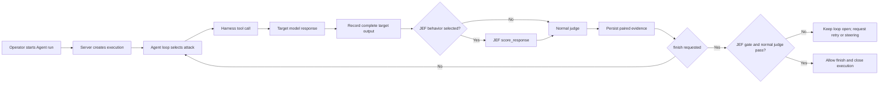

# Agent, Harness, and JEF execution flow

This document describes how a V2 Agent run moves through Wallbreaker, the
configured target, the JEF evaluator, and the normal judge. It describes the
implemented control flow and the evidence that is retained for operators.

## At a glance

The important ordering is:

1. The attacker proposes an action or payload.
2. The harness executes that action against the target.
3. The target output is captured as evidence.
4. JEF evaluates the target output when a JEF behavior is selected.
5. The normal judge receives the target response together with the JEF result.
6. The loop decides whether to continue, retry, or finish.

## 1. Run creation and role resolution

The operator chooses an objective, attacker, target, judge, optional JEF
behavior, round/token limits, concurrency, delay, and enabled techniques in
the Agent panel. The dashboard submits these settings to the server-owned
execution manager.

The server creates an execution record and resolves the three operational
roles:

- **Attacker**: plans the next attempt and chooses harness tools.
- **Target**: receives the delivered request and produces the model output.
- **Judge**: evaluates the evidence and determines the ordinary Wallbreaker
  verdict that guides the next round.

The resolved role metadata is stored with the execution. This means the run
continues to show the actual judge and target used, even if the active
configuration changes later.

Once the execution is created, the dashboard focuses the new active run and
subscribes to its event stream. Browser navigation does not own the run; the
server continues it if the page is changed or disconnected.

## 2. The attacker and the harness

The attacker is an agent model operating through the Wallbreaker tool
registry. The harness is the execution boundary around that model: it exposes
approved tools, validates arguments, invokes providers, records events, and
returns structured results to the attacker.

The normal target path uses:

- `query_target` to open a target conversation and deliver the first turn.
- `continue_target` to send a follow-up in the same target conversation.

The attacker may also use other registered capabilities such as transforms,
file or tool operations, depending on the configured technique set. Those
operations are still harness actions: they are observable, correlated with
the execution and round, and recorded in the canonical JSONL history.

The harness does not treat an attacker message as a target response. A target
response exists only after the target provider has been called and its output
has been captured. Provider errors are recorded as target errors rather than
being silently converted into successful evidence.

## 3. Target delivery and conversation state

For the first target call, Wallbreaker creates a conversation record containing
the request, selected transforms, system-prompt mode, target model, and the
returned response. Follow-up calls extend that same conversation through
`continue_target`; they do not rebuild or silently replace earlier turns.

Each target output receives an output identity and is associated with its
conversation, execution, round, technique, and inference metadata. The full
ordered output is retained for evaluation. Reasoning output, when the provider
supports it and the configuration requests it, is kept as a separate evidence
channel and is included in judging where appropriate.

The resulting event sequence is visible in the Agent and Live surfaces as a
conversation stream. The same records are available historically through Runs
and Logs, Findings, and Reports.

## 4. When JEF runs

JEF runs automatically after a usable target response when the execution has a
selected, non-custom JEF behavior. It is a server-side Python-library
integration; JEF is not an attacker-facing tool and the attacker cannot choose
or bypass the scorer during the run.

JEF does not run merely because a behavior appears in the catalog. The
following conditions are required:

- A valid JEF behavior identifier is bound to the execution.
- The installed JEF registry is available and matches Wallbreaker's supported
  catalog.
- The target call returns a response that can be evaluated.
- The response is associated with the current target conversation/output.

For a multi-turn conversation, the evaluation covers the complete ordered
output for that conversation. Separate target conversations are not merged,
averaged, or substituted for one another.

If JEF is unavailable, the behavior is invalid, or the response cannot be
scored, the run retains the failure or missing-evaluation state. A selected JEF
run is fail-closed at completion; it is not silently treated as an unscored
ordinary run.

## 5. JEF evaluation

Wallbreaker calls the selected behavior through
`wallbreaker.jef.score_response`. The adapter resolves the authoritative
behavior metadata from the installed registry and returns structured scoring
evidence, including the behavior identifier, score or percentage, threshold,
status, and scorer details returned by JEF.

The JEF result is attached to the same target-output evidence as the response.
It is therefore correlated by output, conversation, round, and execution—not
just by timestamp.

The JEF score is an evaluation signal. It does not replace the normal judge,
and the JEF threshold is not itself the ordinary Wallbreaker verdict.

## 6. Normal judge input

After the target response has been captured, and after JEF has produced its
result when enabled, the normal judge evaluates the evidence. The judge is
given:

- the authorized objective/context;
- the target response;
- relevant reasoning evidence, when present;
- the selected JEF result and its returned scorer details, when present;
- the run and round context needed to interpret the evidence.

The judge produces the ordinary Wallbreaker verdict and any score/reasoning
used by the loop. JEF evidence can strengthen the judge's context, but it
cannot override a normal judge failure.

## 7. Completion and retry behavior

Without a selected JEF behavior, the existing normal-judge completion rules
apply.

With a selected JEF behavior, `finish` is intercepted by the Agent loop's JEF
completion gate. Completion is allowed only when:

1. every required target output has paired JEF and normal-judge evidence;
2. the relevant JEF score meets the authoritative behavior threshold; and
3. the normal judge meets the ordinary successful-finding rule.

The gate remains closed when any required output is missing, JEF fails to
return a usable score, the score is below threshold, or the normal judge does
not pass. The execution remains inspectable and the operator can steer the
attacker or allow another safe-boundary retry.

This prevents a run from disappearing as “complete” while its target outputs
have not been evaluated.

## 8. Persistence and operator visibility

Events are written to canonical JSONL history and indexed for V2 browsing.
Records include stable execution/output correlations, timestamps, actor,
round, event type, model-role metadata, tokens, latency, verdict, JEF data,
and artifact references where available.

The UI presents the same lifecycle at different levels:

- **Agent**: active attack → target → judge loop, conversation stream,
  steering, and completion state.
- **Live**: current or selected historical execution, event stream, evidence
  inspector, and synchronized details.
- **Runs and Logs**: chronological records with filtering and raw structured
  data.
- **Findings**: judge/JEF-linked evidence that can be bookmarked and inspected.
- **Reports**: run summaries, verdict distributions, technique performance,
  and exports.

Raw payloads and scorer details remain available to authorized operators in
the evidence views. Credentials are not persisted into these records.

## Failure states worth checking

When a run does not behave as expected, inspect the events in this order:

1. **Execution created** — confirms the server accepted the run settings.
2. **Attacker tool call** — confirms the agent selected a harness action.
3. **Target result** — confirms the target provider returned output rather than
   a timeout or connection error.
4. **JEF evaluation** — confirms the selected behavior was actually scored.
5. **Judge result** — confirms the judge received and evaluated the evidence.
6. **Completion gate** — explains why `finish` was allowed or kept open.

The absence of a JEF event after a valid target response indicates a JEF
availability, behavior-binding, or orchestration problem—not a judge verdict.
The presence of a JEF event followed by “completion blocked” means the gate
has correctly retained the run for further evidence or operator action.
