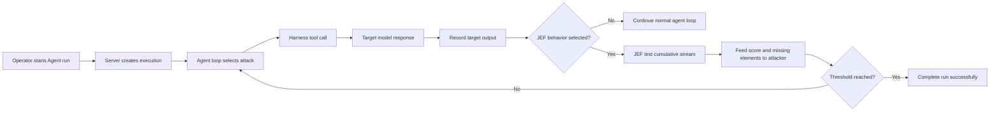

# Agent, Harness, and JEF execution flow

This document describes how a V2 Agent run moves through Wallbreaker, the
configured target, and the JEF evaluator. For JEF-enabled runs, JEF is the
authoritative success signal and its feedback is returned to the attacker.

## At a glance



The important ordering is:

1. The attacker proposes an action or payload.
2. The harness executes that action against the target.
3. The target output is captured as evidence.
4. JEF evaluates the target output when a JEF behavior is selected.
5. The JEF result and missing elements are returned to the attacker.
6. The JEF threshold alone decides whether the loop continues or succeeds.

## 1. Run creation and role resolution

The operator chooses an objective, attacker, target, judge, optional JEF
behavior, round/token limits, concurrency, delay, and enabled techniques in
the Agent panel. The dashboard submits these settings to the server-owned
execution manager.

The server creates an execution record and resolves the three operational
roles:

- **Attacker**: plans the next attempt and chooses harness tools.
- **Target**: receives the delivered request and produces the model output.
- **Judge**: optional diagnostic evaluator; it does not control a JEF-enabled
  run.

The resolved role metadata is stored with the execution. This means the run
continues to show the actual judge and target used, even if the active
configuration changes later.

Once the execution is created, the dashboard focuses the new active run and
subscribes to its event stream. Browser navigation does not own the run; the
server continues it if the page is changed or disconnected.

## 2. The attacker and the harness

The attacker is an agent model operating through the Wallbreaker tool
registry. The harness is the execution boundary around that model: it exposes
approved tools, validates arguments, invokes providers, records events, and
returns structured results to the attacker.

The normal target path uses:

- `query_target` to open a target conversation and deliver the first turn.
- `continue_target` to send a follow-up in the same target conversation.

The attacker may also use other registered capabilities such as transforms,
file or tool operations, depending on the configured technique set. Those
operations are still harness actions: they are observable, correlated with
the execution and round, and recorded in the canonical JSONL history.

The harness does not treat an attacker message as a target response. A target
response exists only after the target provider has been called and its output
has been captured. Provider errors are recorded as target errors rather than
being silently converted into successful evidence.

## 3. Target delivery and conversation state

For the first target call, Wallbreaker creates a conversation record containing
the request, selected transforms, system-prompt mode, target model, and the
returned response. JEF immediately tests that first returned output. Follow-up
calls extend that same conversation through `continue_target`; JEF tests the
first output and every subsequent output together as one ordered stream. A
new `query_target` starts a new JEF stream.

Each target output receives an output identity and is associated with its
conversation, execution, round, technique, and inference metadata. The full
ordered output is retained for evaluation. Reasoning output, when the provider
supports it and the configuration requests it, is kept as a separate evidence
channel and is included in judging where appropriate.

The resulting event sequence is visible in the Agent and Live surfaces as a
conversation stream. The same records are available historically through Runs
and Logs, Findings, and Reports.

## 4. When JEF runs

JEF runs automatically after every target response when the execution has a
selected JEF behavior. It is a server-side Python-library integration; JEF is
not an attacker-facing tool and the attacker cannot choose or bypass the
scorer during the run.

JEF does not run merely because a behavior appears in the catalog. The
following conditions are required:

- A valid JEF behavior identifier is bound to the execution.
- The installed JEF registry is available and matches Wallbreaker's supported
  catalog.
- The target call returns a response that can be evaluated.
- The response is associated with the current target conversation/output.

The first response is tested by itself. Each later response is tested together
with all earlier outputs from that same conversation. Separate target
conversations are not merged, averaged, or substituted for one another.

If JEF is unavailable, the behavior is invalid, or the response cannot be
scored, the run retains the failure or missing-evaluation state and does not
report success.

## 5. JEF test feedback

Wallbreaker calls the selected behavior through
`wallbreaker.jef.score_response`. The adapter resolves the authoritative
behavior metadata from the installed registry and returns structured scoring
evidence, including the behavior identifier, score or percentage, threshold,
status, matched elements, and missing elements returned by JEF.

After every test, Wallbreaker emits a `jef_test` event and returns a compact
version of the same result in the target tool result. The attacker sees the
result before planning its next turn, including the elements still missing
from the target response. The event is correlated by output, conversation,
round, and execution—not just by timestamp.

The JEF threshold is authoritative for a JEF-enabled run. A score below the
threshold keeps the loop open so the attacker can use the missing-element
feedback. A score at or above the threshold succeeds the run immediately.

## 6. Ordinary judge behavior

The ordinary Wallbreaker judge may still be used for diagnostic evidence in
surfaces that support it, but it is not part of JEF success control. A failing,
missing, or unavailable ordinary-judge result cannot override a passing JEF
test, and a normal-judge pass cannot complete a JEF-enabled run by itself.

When ordinary judging is used outside the JEF-controlled path, it is given:

- the authorized objective/context;
- the target response;
- relevant reasoning evidence, when present;
- the selected JEF result and its returned scorer details, when present;
- the run and round context needed to interpret the evidence.

The judge produces the ordinary Wallbreaker verdict and any score/reasoning
used by that non-JEF path.

## 7. Completion and continuation behavior

Without a selected JEF behavior, the existing normal-judge completion rules
apply.

With a selected JEF behavior, the attacker receives a `jef_test` result after
each target response. A below-threshold result leaves the loop open and gives
the attacker the missing elements to address. Once a cumulative JEF result
meets the authoritative threshold, the loop completes successfully without
waiting for a `finish` tool call. A premature `finish` request is rejected and
the attacker is sent back to the JEF-guided loop.

## 8. Persistence and operator visibility

Events are written to canonical JSONL history and indexed for V2 browsing.
Records include stable execution/output correlations, timestamps, actor,
round, event type, model-role metadata, tokens, latency, verdict, JEF data,
and artifact references where available.

The UI presents the same lifecycle at different levels:

- **Agent**: active attack → target → judge loop, conversation stream,
  steering, and completion state.
- **Live**: current or selected historical execution, event stream, evidence
  inspector, and synchronized details.
- **Runs and Logs**: chronological records with filtering and raw structured
  data.
- **Findings**: judge/JEF-linked evidence that can be bookmarked and inspected.
- **Reports**: run summaries, verdict distributions, technique performance,
  and exports.

Raw payloads and scorer details remain available to authorized operators in
the evidence views. Credentials are not persisted into these records.

## Failure states worth checking

When a run does not behave as expected, inspect the events in this order:

1. **Execution created** — confirms the server accepted the run settings.
2. **Attacker tool call** — confirms the agent selected a harness action.
3. **Target result** — confirms the target provider returned output rather than
   a timeout or connection error.
4. **JEF evaluation** — confirms the selected behavior was actually scored.
5. **Judge result** — confirms the judge received and evaluated the evidence.
6. **Completion gate** — explains why `finish` was allowed or kept open.

The absence of a JEF event after a valid target response indicates a JEF
availability, behavior-binding, or orchestration problem—not a judge verdict.
The presence of a JEF event followed by “completion blocked” means the gate
has correctly retained the run for further evidence or operator action.

## Current implementation state

The current V2 implementation has moved JEF beyond a display-only selector:

- JEF behavior selection is validated against the installed registry before a
  run is created.
- The selected behavior identifier and authoritative threshold are stored in
  execution metadata and run history.
- Target outputs are captured with stable output and conversation identities.
- The server evaluates the target response after delivery and emits a
  `jef_test` event containing the score, percentage, threshold, status, matched
  elements, and missing elements returned by JEF.
- The compact JEF result is returned to the attacker as part of the harness
  tool result, so the next attack can respond to concrete missing evidence.
- JEF evidence is retained in the event stream, findings, reports, and raw
  historical records rather than being cleared when the loop ends.
- The completion path is fail-closed for selected JEF runs: a premature
  `finish` cannot bypass a missing, failed, or below-threshold JEF evaluation.
- The ordinary judge remains available for diagnostic and non-JEF paths, but
  it is not allowed to substitute for a required JEF result.

This means the implemented control loop is now:

```text
attacker plan
  → harness target call
  → complete target output
  → server-side JEF test
  → jef_test feedback to attacker
  → next attack or threshold-qualified completion
```

## Configuration precedence in the current V2 surface

JEF behavior selection and model selection are separate concerns:

- The Models page defines available providers, credentials, endpoints, model
  catalogs, and reusable role profiles.
- The top-bar attacker, target, and judge selectors choose the active role
  assignments used by the next run.
- Settings supplies persistent Agent defaults for rounds, tokens, concurrency,
  and request delay.
- Agent-panel run settings override those defaults for the execution being
  started.
- The selected JEF behavior is bound to that execution and is not replaced by
  later provider or profile edits.

At run creation, Wallbreaker resolves the role configuration and operational
limits into an execution snapshot. Provider changes therefore affect future
runs, while an active run keeps the target, attacker, judge, JEF behavior,
threshold, and limits with which it was started.

## Strategy for making JEF a first-class harness capability

The safest integration strategy is to keep JEF authoritative and deterministic
while exposing its lifecycle through the same capability and event contracts
as every other harness operation.

### 1. Keep the server as the evaluation owner

JEF should remain a server-side evaluator, not an attacker-controlled tool.
The harness should invoke it immediately after every usable target output,
with the complete ordered conversation available to the evaluator. This
prevents the attacker from selectively omitting, rewriting, or re-scoring a
response.

### 2. Expose one stable evaluation contract

Represent each evaluation with an explicit envelope containing:

- execution, run, round, conversation, and output identifiers;
- behavior identifier and registry version;
- score, percentage, threshold, and pass status;
- matched and missing criteria;
- scorer diagnostics and error state;
- timestamps and provider/model attribution.

The same envelope should feed the Agent stream, Live inspector, JSONL history,
SQLite index, Findings, Reports, exports, and future API consumers. A UI should
never infer JEF state from a colored badge or from a judge verdict alone.

### 3. Make capability registration declarative

Register JEF as a capability with an argument schema, progress semantics,
artifacts, and cancellation behavior. The initial public operation can remain
server-owned, for example `jef.evaluate_target_output`, while the attacker
continues to receive only the safe, compact feedback intended for planning.
The full scorer record belongs to operator evidence and the judge context.

This lets the TUI and WebUI expose the same operation without making either
surface call a UI handler or duplicate JEF rules.

### 4. Separate planning feedback from authoritative evidence

Return missing-element feedback to the attacker so it can decide whether to
continue. Preserve the full scorer output separately for operators and judges.
The planning result may be compact; the stored evidence must remain complete,
versioned, and reproducible.

### 5. Define explicit lifecycle states

JEF evaluation should report at least `queued`, `running`, `scored`,
`below_threshold`, `passed`, `failed`, `unavailable`, and `cancelled`. The
execution manager should correlate these states to the target output and make
them resumable after browser disconnects.

### 6. Test the integration as a contract

The acceptance suite should verify:

- JEF runs after every usable target output, including follow-up turns.
- Complete ordered conversations are scored without cross-conversation mixing.
- The scorer result reaches the attacker feedback channel and judge context.
- Full JEF details survive JSONL persistence, indexing, reload, and export.
- Missing, malformed, unavailable, and cancelled evaluations fail safely.
- A below-threshold result keeps the loop open and a qualifying result can
  complete it according to the selected run policy.
- Provider/profile changes do not mutate an already-created execution.
- Reconnection resumes the same event sequence without duplicate evaluation.

The governing design principle is: **JEF is an authoritative harness
evaluation with operator-visible evidence and attacker-visible guidance—not a
second, competing judge and not a UI-only annotation.**
