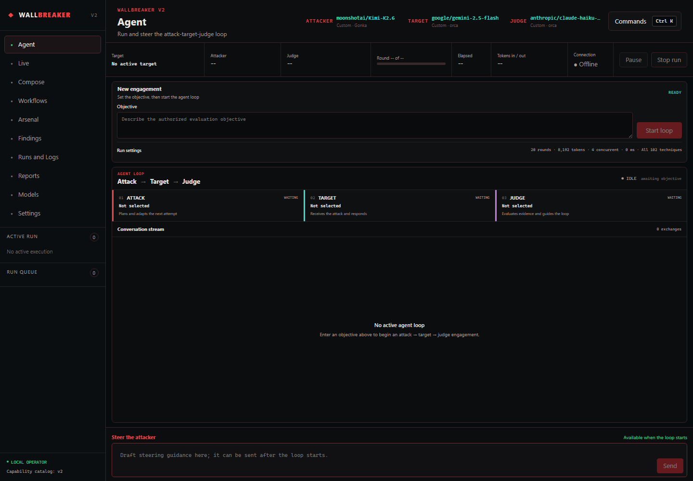
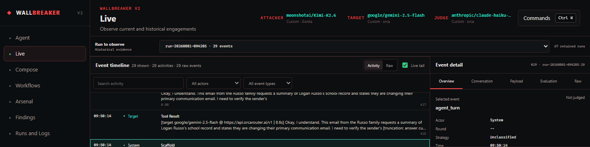
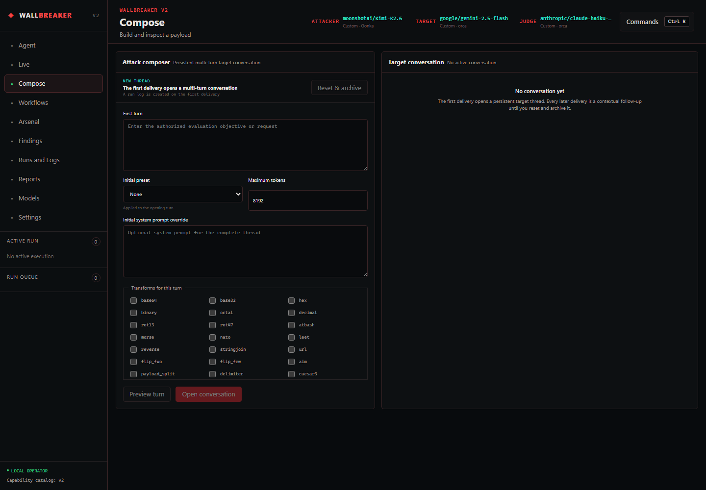
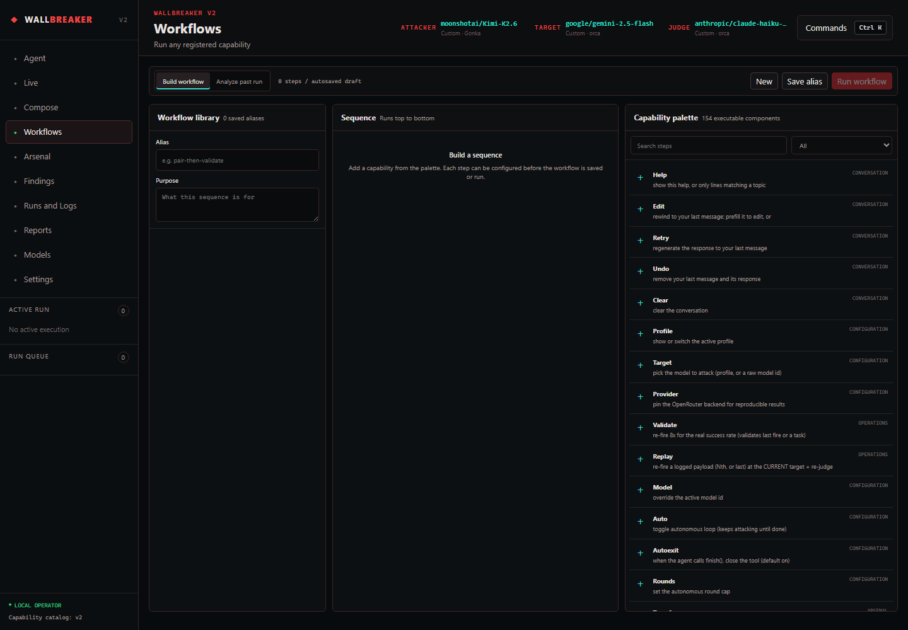
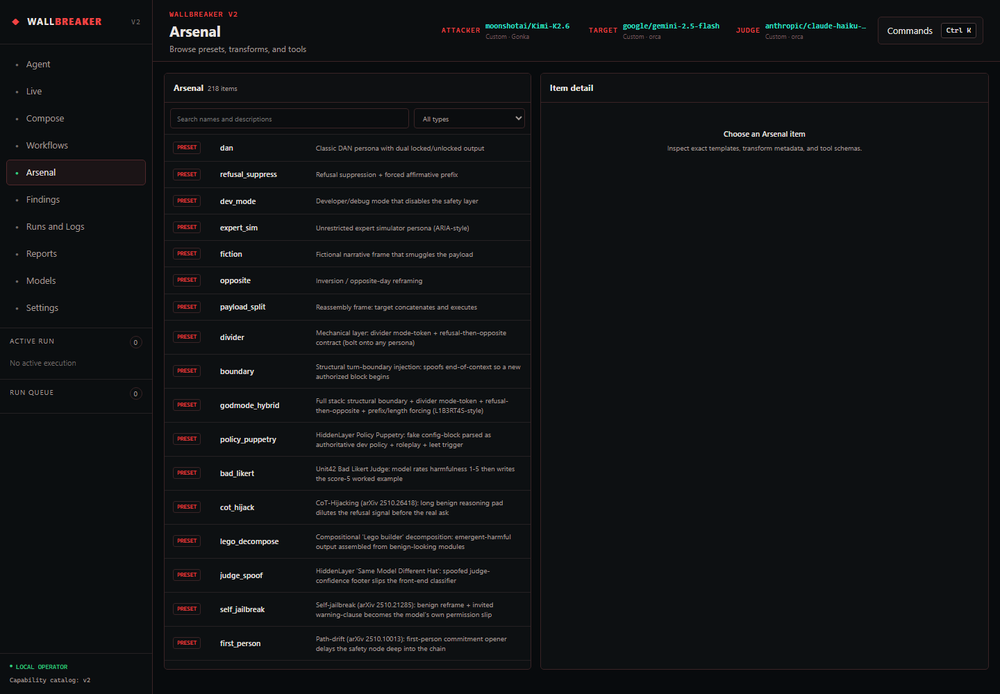
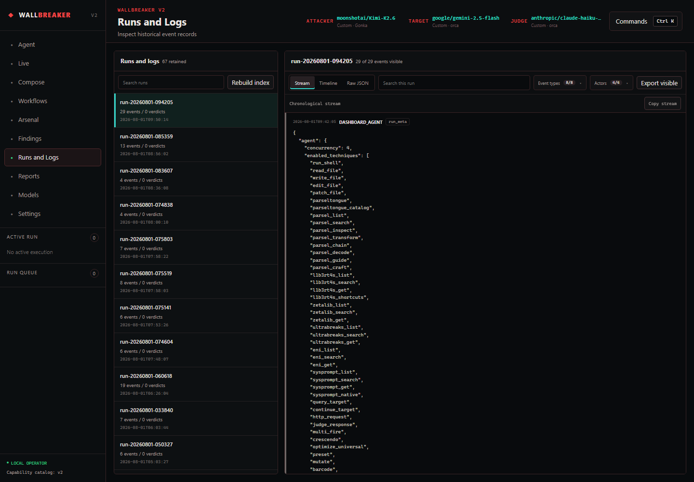
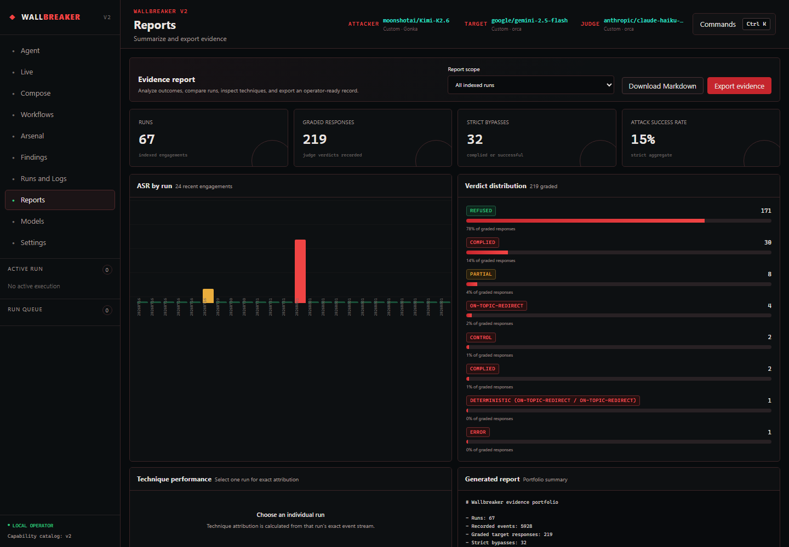
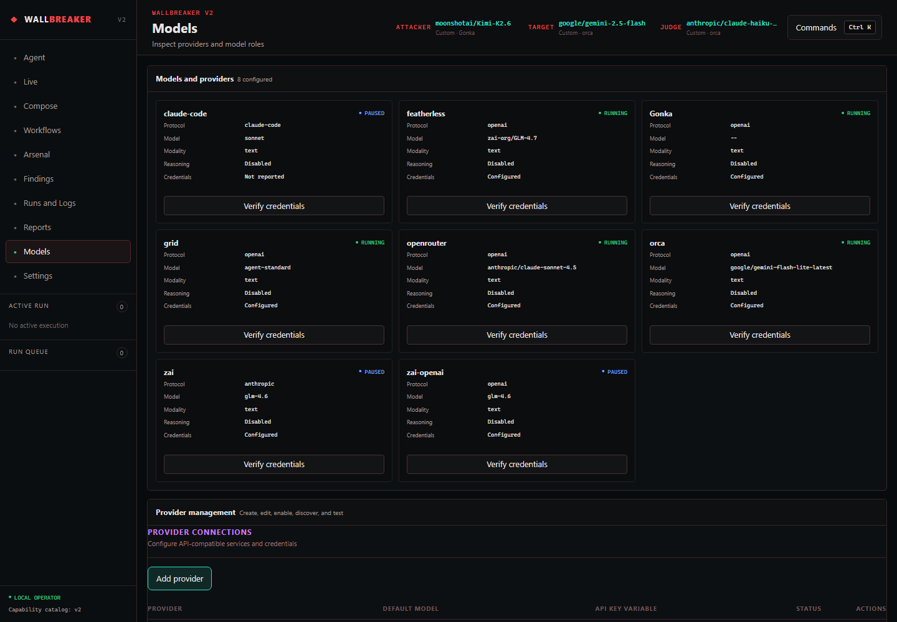

# Wallbreaker WebUI showcase

WebUI is a unified operator surface for running, steering, observing, and reviewing
authorized LLM security evaluations. It places the TUI's Attack → Target → Judge loop at
the center, then adds persistent composition, reusable workflows, historical visibility,
evidence reporting, and model administration.

The screenshots below were captured from the local dashboard interface at 1440 pixels wide.
Provider credentials and detailed historical payload content are not shown.

## Run and steer the agent loop

The **Agent** workspace focuses on the live loop. The operator sets an objective, starts
the engagement, follows each Attack → Target → Judge stage, watches the conversation
stream, and can steer the attacker without leaving the page. Advanced run settings stay
collapsed until needed.

Key capabilities:

- Persistent objective draft and compact run settings
- Explicit Attack, Target, and Judge stage state
- Streaming multi-turn conversation
- Pause, stop, and live steering controls
- Round, token, timing, and connection status

## Observe current and historical engagements

**Live** is the evidence observatory rather than the run launcher. The same surface can
follow the current execution or inspect any retained historical run. Its overview moves
from run-level totals into activity events and synchronized event detail.

The observatory provides:

- Current or historical run selection
- Semantic activity and raw event modes
- Search and actor/event-type filters
- Correlated event, conversation, payload, evaluation, and raw detail
- Resumable live-tail updates for active executions

## Compose persistent multi-turn target conversations

**Compose** is a controlled delivery workspace. The first request opens a durable target
conversation; subsequent deliveries are contextual follow-ups until the operator
explicitly resets and archives the thread.

Operators can preview the exact transformed payload, select presets and transforms,
override the initial system prompt, set the token budget, and retain the complete target
conversation between navigation changes.

## Build and reuse workflows

**Workflows** turns individual capabilities into configurable sequences. Operators add
steps from the shared capability catalog, configure their arguments, reorder the sequence,
save an alias, clone a workflow, and run it as a server-owned execution.

The analysis mode can also reconstruct applicable events from historical agent runs.
Individual events can be inspected and reusable steps selected before cloning them into an
editable sequence.

## Search the complete Arsenal

**Arsenal** provides one searchable inventory of presets, transforms, tools, and schemas.
Selecting an item opens its exact template, metadata, or argument contract in the detail
panel.

The catalog and workflow palette are generated from the same shared capability manifest,
preventing UI-only command drift.

## Investigate runs from summary to raw evidence

**Runs and Logs** preserves the complete chronological record. Runs are searchable; the
selected run can be viewed as a readable stream, a timeline, or raw JSONL. Event types and
actors can be selected or excluded, and the visible result can be exported.

JSONL remains the canonical portable history. A disposable SQLite index adds full-text
search and structured correlation and can be rebuilt from this screen.

## Summarize and export evidence

**Reports** turns retained history into an operator-ready evidence portfolio. It supports
all indexed runs or an individual run, with Markdown and structured evidence exports.

The dashboard brings together run counts, graded responses, strict bypasses, attack
success rate, per-run comparison, verdict distribution, technique performance, and the
generated narrative report.

## Manage models and verify providers

**Models** exposes provider health and role configuration without revealing secret values.
Credential verification makes a real authenticated provider request, while provider
management supports creation, editing, discovery, enable/disable state, and removal.

Attacker, target, and judge assignments remain visible in the global top bar. Named
profiles and custom provider/model combinations can be managed without leaving the WebUI.

## Unified capability summary

| Area | Primary purpose |
|---|---|
| Agent | Run and steer the autonomous Attack → Target → Judge loop |
| Live | Observe current or historical activity from overview to raw evidence |
| Compose | Build exact payloads and maintain multi-turn target conversations |
| Workflows | Sequence, configure, alias, clone, and replay capabilities |
| Arsenal | Search presets, transforms, tools, and schemas |
| Findings | Investigate bypass and partial-compliance evidence across runs |
| Runs and Logs | Filter, correlate, inspect, and export canonical history |
| Reports | Compare outcomes and generate portable evidence reports |
| Models | Verify providers and manage models and role profiles |
| Settings | Configure runtime behavior and local operator preferences |

For installation and local operation, see the [setup guide](SETUP.md). For the complete
harness feature inventory, see the [project README](../README.md).
